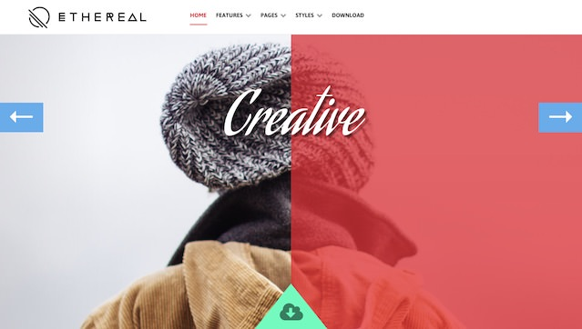

Introduction
-----

Ethereal is an exquisitely designed theme, bursting with elegance, sharpness and bold, but complementary visuals; achieved via a subtle color scheme with dashes of vibrancy, within a rich framework of emphasized typography and iconography.

Requirements
-----
* PHP 5.5.9+
* Curl
* OpenSSL Libraries
* Multibyte String Support

>> NOTE: Gantry v5.4.9+ is required for Ethereal to work correctly. For more details on the Gantry Framework, please visit its [Dedicated Website](http://gantry.org).

Key Features
-----

### Included Particles

* Blog Content
* Branding
* Contact
* Content List
* Ethereal Block
* Grav Content
* Horizontal Menu
* Icon Headline
* Image Block
* Image Grid
* Image Overlay
* Info List
* Mobile Menu
* Newsletter
* Number Headline
* Promo Image
* Simple Counter
* Slideshow

### Theme Features

* Responsive Layout
* 10 Preset Styles
* Custom Typography
* Unlimited Positions
* Custom Particles
* Mobile Menu
* Coming Soon Page
* Font Awesome Icons 

### Gantry Core Features

* YAML-based Configuration
* Twig Templating
* Powerful Particle System
* Visual Menu Editor
* MegaMenu Support
* Off-Canvas Panel
* Ajax Admin
* Layout Manager
* SCSS Support
* Sophisticated Fields
* Unlimited Undo/Redo
* Styles Panel

## Layout Manager

The Gantry 5 Layout manager benefits from a drag and drop interface, providing an easy mechanism for configuring positions and particles. Furthermore, there are now no restrictions to the number of positions you can have. It is truly unlimited.

## Style Settings

Ethereal's pre-built presets are displayed in the Styles tab for you to preview, individually customize and apply. You'll also find an assortment of individual style options, such as text and background colors for the various sections, allowing for easy color changes.

## Responsive

A responsive layout adapts to the viewing device's width, such as mobile, tablet or desktop. Mobile modes have a unique menu to aid usability. Support classes can also be used to display or hide various types of content for each device.
