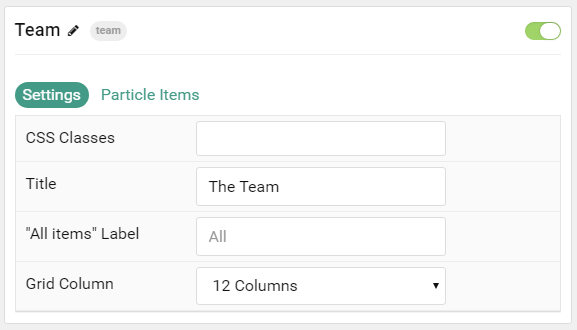
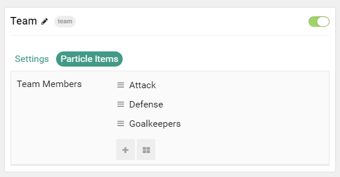
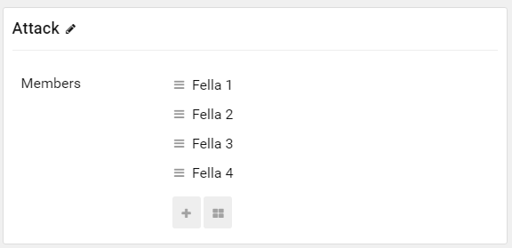
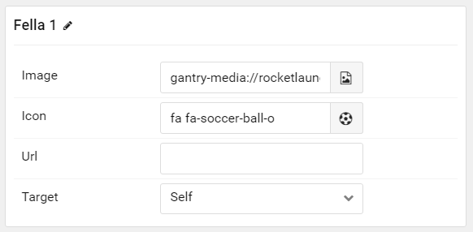

## Introduction

The **Team** particle is designed to make displaying your team members easy.

Here are the topics covered in this guide:

* [Configuration](#configuration)
    - [Main Options](#main-options)
    - [Item Options](#item-options)

## Configuration

### Main Options 

These options affect the main area of the particle, and not the individual items within.

| Option            | Description                                                                   |
| :-----            | :-----                                                                        |
| CSS Classes       | Enter the CSS class(es) you want to use in the content of the particle.       |
| Title             | Enter the title of the particle, as it will appear on the front end.          |
| "All Items" Label | Enter text to appear as the label of the "All Items" toggle on the front end. |
| Grid Column       | Set the number of columns team members appear in.                             |

### Item Options

These items make up the individual featured items in the particle. 

| Option            | Description                                                                         |
| :-----            | :-----                                                                              |
| Item Name         | The item name becomes the title of the content team item.                           |
| Image             | Select the image you would like to have displayed with the item.                    |
| Icon              | Select the icon you would like to have appear with the title area in the team item. |
| URL               | Enter the url you want that link to go to.                                          |
| Target            | Set the target for the button. You can choose between **Self** which opens the link in the current tab or **New Window** which opens links in a new tab. |