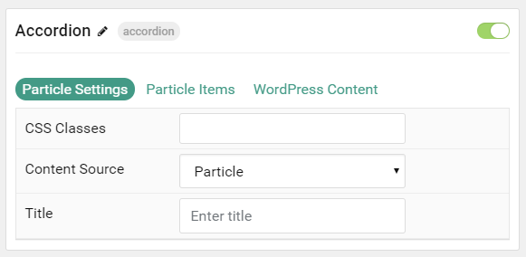
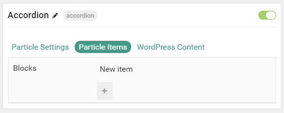

## Introduction

The **Accordion** particle enables you to display one or more items in a single column.

Here are the topics covered in this guide:

* [Configuration](#configuration)
    - [Main Options](#main-options)
        + [Particle Settings](#tab-a---particle-settings)
        + [Particle Items](#tab-b---particle-items)
        + [WordPress Content](#tab-c---wordpress-content)
    - [Item Options](#item-options)

### Main Options 

#### Tab A - Particle Settings

| Option         | Description                                                           |
| :-----         | :-----                                                                |
| CSS Classes    | Sets the CSS class for the content of the particle.                   |
| Content Source | Choose between **Particle** and **WordPress** as your content source. |
| Title          | Sets the title of the particle, as it will appear on the front end.   |

#### Tab B - Particle Items

This tab enables you to create items that appear in the particle. It is useful if you choose the **Particle** content source.

### Item Options

These items only appear on the front end if you select **Particle** as the **Content Source**.

| Option         | Description                                                               |
| :-----         | :-----                                                                    |
| Description    | Enables you to enter a descriptive paragraph to be displayed in the item. |
| Button Label   | Enter a text label that will appear as the link in the item.              |
| Button Link    | Set a link you would like the item to connect to.                         |
| Target         | Choose a target (self or new window) for the link.                        |
| Button Classes | Enter any CSS class(es) you would like to have apply to the button link.  |

#### Tab C - WordPress Content

This tab is where you configure how WordPress content appears as items in the particle. It is useful if you choose the **WordPress** content source.

| Option               | Description                                                                                         |
| :-----               | :-----                                                                                              |
| WordPress Categories | Select the categories of posts this particle will display.                                          |
| Posts to Fetch       | Select the number of posts you would like the particle to fetch.                                    |
| Content Type         | Select the type of content to display in the particle. Options include: **Content** and **Exerpt**. |
| Display Content      | **Enable** or **Disable** the display of the post(s) content or excerpt.                            |
| Link                 | **Enable** or **Disable** the linking of the post(s).                                               |
| Link Text            | Enter the text you wish to have displayed as the read more link.                                    |
| Target               | Select **Self** or **New Window** as the target for the link.                                       |

