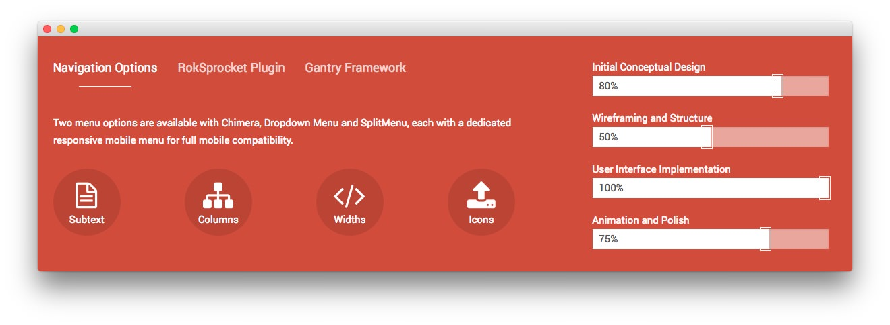

Expanded Top Section
-----

:   1. **RokSprocket (Tabs)** [13%, 6%, se]
    2. **Text** [13%, 65%, se]

Here is the widget breakdown for the Expanded Top section:

* RokSprocket (Tabs)
* Gantry Divider
* Text

#### RokSprocket

You will need to do two things to prepare this widget so that it looks similar to the one in the demo.

First, you will need to create the RokSprocket Widget. You can do this by navigating to **Administration -> RokSprocket Admin** and creating a new **Tabs** widget.

You can find out more about RokSprocket and how to set up and modify widgets by visiting our [RokSprocket documentation](../../plugins/roksprocket).

**Simple Content Provider**

We used the **Simple** Content Provider to allow us to make custom tabs without having to build posts on the back-end. In this case, the **Tab Label** and **Description** are custom, while the other options are left at default or **None** settings. You will find the settings used in one of these items below.

*Tab Label*

~~~ .html
Navigation Options
~~~

*Description*

~~~ .html

Two menu options are available with Chimera, Dropdown
Menu and SplitMenu, each with a dedicated responsive mobile menu for full
mobile compatibility.

    

        

            

                

                    <i class="fa fa-file-text-o"></i> Subtext
                

            

        

        

            

                

                    <i class="fa fa-sitemap"></i> Columns
                

            

        

        

            

                

                    <i class="fa fa-code"></i> Widths
                

            

        

        

            

                

                    <i class="fa fa-upload"></i> Icons
                

            

        

    

~~~

Here is a look at the **Tabs Layout Options** for this widget.

| Option          | Setting        |
| :-------------- | :------------  |
| Theme           | Default        |
| Display Limit   | ∞              |
| Tabs Position   | Top            |
| Animation       | Slide and Fade |
| Autoplay        | Disable        |
| Autoplay Delay  | 5              |
| Image Resize    | Disable        |
| Preview Length  | 0              |
| Strip HTML Tags | No             |

You can set the RokSprocket filters to include any category, specific articles, or otherwise you would like to have featured in this widget.

Once you have created this widget, you can add it via the Widgets menu by clicking **RokSprocket** and dragging it to the appropriate section. When you have done this, you will need to complete the following.

* Select your RokSprocket Tabs widget in the **Choose Widget** field.
* Enter `fp-roksprocket-tabs` in the **Custom Variations** field.
* Leaving everything else at its default setting, select **Save**.

The widget should now be created and ready for use on the front page of your WordPress site.

#### Gantry Divider

This widget tells WordPress to start a new widget column beginning with the widget placed directly below the divider in the section.

#### Text

This section of the page is a standard text widget. You will need to enter the following in the main text field.

~~~ .html

Initial Conceptual Design

  

    80%
  

Wireframing and Structure

  

    50%
  

User Interface Implementation

  

    100%
  

Animation and Polish

  

    75%
  

~~~

Here is a breakdown of options changes you will want to make to match the demo.

* Set the **Widget Variations** option to **RT-Center**.
* Leaving everything else at its default setting, select **Save**.
