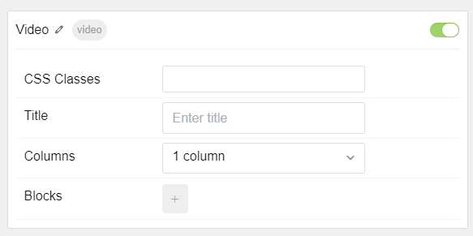
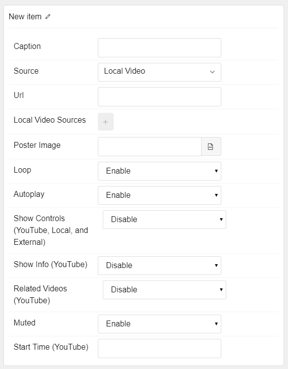

## Introduction

The **Video** particle enable you quickly and easily add video content to your page. This particle has support for Vimeo, YouTube, and local video sources. The main difference between them is how they display this content.

Here are the topics covered in this guide:

* Video
    - [Configuration](#configuration)
        - [Main Options](#main-options)
        - [Item Options](#item-options)

## Configuration

### Main Options

These options affect the main area of the particle, and not the individual items within.

| Option        | Description                                                                                 |
| :-----        | :-----                                                                                      |
| Particle Name | Enter the name you would like to assign to the particle. This only appears in the back end. |
| CSS Classes   | Sets any CSS class(es) you want to have apply to the particle's content.                    |
| Title         | Enter a title for the particle.                                                             |
| Columns       | Select the amount of columns.                                                               |

### Item Options

These items make up the individual featured items in the particle.

| Option         | Description                                                                                                                                        |
| :-----         | :-----                                                                                                                                             |
| Item Name      | Designates a name for the item that appears in the back end only.                                                                                  |
| Caption        | Enter a caption for the video.                                                                                                                     |
| Source         | Select the source you would like to use. Options are: **Slideshow Preset**, **Vimeo URL**, **YouTube URL**, **Local Video**, and **External URL**. |
| Url            | Enter the URL for the video (if using either External URL, Vimeo URL or YouTube URL as a source).                                                  |
| Poster Image   | Select a poster image for the local or external video.                                                                                             |
| Loop           | **Enable** or **disable** video looping.                                                                                                           |
| Autoplay       | **Enable** or **disable** autoplay. Some services may not allow autoplay.                                                                          |
| Show Controls  | Show video controls (YouTube, Local, and External)                                                                                                 |
| Show Info      | **Enable** or **Disable** the top info bar for YouTube videos.                                                                                     |
| Related Videos | **Enable** or **Disable** the display of related videos at the end of the embedded video.                                                          |
| Muted          | Local and External videos must be Muted in order for Autoplay to work on Android / iOS devices.                                                    |

## File Support

The particle has local support for any video format that can be natively embedded using HTML5. This includes: MP4, WebM, Mov, and Ogg videos. If you would like a point of reference, we used a 1280x720 video in the RocketLauncher. This is a standard video format that is commonly available as a preset in most video encoding programs.

Variables such as your bit rate will vary depending on the type of content in the video, as well as the frame rate of the video being presented. High action and/or high framerate video will need higher bit rates while low-action video such as screencasts and shots of a plain background with little overall movement can get by with lower bit rates.

To break this down, here are some examples. You do NOT have to abide by these resolutions or video settings. We recommend strongly checking out the [HTML5 video support documentation](http://www.w3schools.com/html/html5_video.asp) available at W3 for additional perspective.

| Resolution | Video Codec | Audio Codec | Container | Bitrate   |
| :-----     | :-----      | :-----      | :-----    | :-----    |
| 320x240    | h.264       | AAC         | MP4       | 400 kbps  |
| 480x270    | h.264       | AAC         | MP4       | 700 kbps  |
| 640x360    | h.264       | AAC         | MP4       | 1400 kbps |
| 1280x720   | h.264       | AAC         | MP4       | 2500 kbps |
| 1920x1080  | h.264       | AAC         | MP4       | 4000 kbps |

To save time and resources on page loads, you will want to encode your video at a relatively low bit rate. Keep in mind that as a general rule: the lower your bit rate, the lower the quality of the video. It's almost impossible to state a one-size-fits-all bit rate that lets all videos look great while being as small in file size as possible. The best practice is to do some trial and error.

Alternatively, YouTube compresses videos for you, and it is supported by this particle. This would be the easiest method available to you, and you save on bandwidth as you won't be serving the actual video file yourself.
