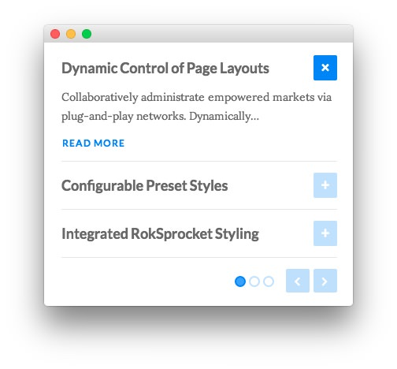

Sidebar Section
-----

Here is the widget breakdown for the Sidebar section:

#### RokSprocket

The widget located in this section of the page is a **RokSprocket Lists** widget created in a very similar way to the previous RokSprocket widgets featured on the front page of the demo.

First, you will need to create the RokSprocket widget. You can do this by navigating to **Administration -> RokSprocket Admin** and creating a new **Lists** widget. The provider we used in this particular widget is **WordPress**. This enables the widget to pull from standard WordPress content.

You can find out more about RokSprocket and how to set up and modify widgets by visiting our [RokSprocket documentation](../../plugins/roksprocket).

Here is a look at the **Lists Layout Options** for this widget.

|        Option       | Setting |
| :------------------ | :------ |
| Theme               | Default |
| Collapsible Preview | Enable  |
| Display Limit       | ∞       |
| Preview Length      | 8       |
| Strip HTML Tags     | Yes     |
| Previews Per Page   | 3       |
| Arrow Navigation    | Show    |
| Pagination          | Show    |
| Autoplay            | 5       |
| Image Resize        | Disable |

You can set the RokSprocket filters to include any category, specific articles, or otherwise you would like to have featured in this widget.

Once you have created this widget, you can add it via the Widgets menu by clicking **RokSprocket** and dragging it to the appropriate section. When you have done this, you will need to complete the following.

* Enter `fp-roksprocket-lists-sidebar wow fadeInRight` in the **Custom Variations** field.
* Leaving everything else at its default setting, select **Save**.

The widget should now be created and ready for use on the front page of your WordPress site.