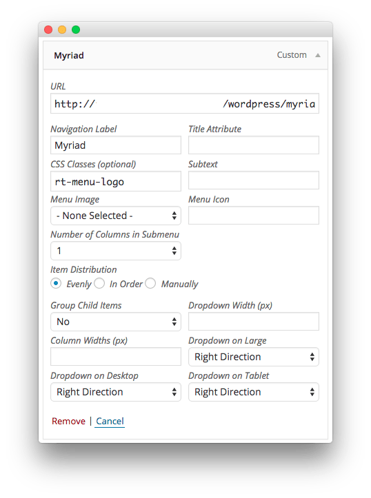

Where can I find theme settings
-----
* Log in to the WordPress administrative dashboard at http://www.yoursite.com/wp-admin/
* Select the **Myriad Settings** sidebar tab on the left of the dashboard.
* For more information visit our [Gantry documentation](http://docs.gantry.org/gantry4/configure) on the settings menu.

How to Change the Logo as it Appears in the Main Menu
-----

The Myriad template features a text logo, with some accents (such as the white underlined) defined in CSS. You can make changes to this to meet your individual needs.

#### Step 1: Create a New Logo File

The first thing you will want to do is create a **logo.png** file featuring your new logo. The **png** file type enables you to maintain transparency and preserve quality. Our current text logo consumes **132px by 24px** of space, so when creating your logo image, keep this in mind.

Once you've created your **logo.png** (keep it a PNG so you can retain transparency to not hide the background) upload it to your `WORDPRESS_ROOT/wp-content/themes/rt_myriad_wp/images/logo` folder. There will likely be a file there already featuring the default Myriad logo. Just replace this file with your own.

#### Step 2: Create a CSS File

Next, you will want to add the following to a file you create in `WORDPRESS_ROOT/wp-content/themes/rt_myriad_wp/css/` called **rt_myriad_wp-custom.css**.

~~~ .css
/* non-destructive removal of text logo */
li.rt-menu-logo > a > span {
    opacity: 0;
    height: 0;
}
 
/* addition of background image logo */
.menu-block .gf-menu .rt-menu-logo {
    background: url(../images/logo/logo.png);
    background-repeat: no-repeat;
    background-position: left center;
    width: 148px;
    height: 60px;
}
 
/* Adjust menu-logo underline position */
.menu-block .gf-menu .rt-menu-logo:after {
    bottom: 0px !important;
}
/* If needed use this Code Block to increase <a> area to match logo size*/
.menu-block .gf-menu .rt-menu-logo .item {
    padding-right: 180px !important;
}
/* Remove the meno-logo white underline */
/**** to use remove this comment line
.menu-block .gf-menu .rt-menu-logo:after {
    background: transparent !important;
}
**** to use remove this comment line /
~~~

You can adjust the **width, height, bottom, and padding-right** settings to meet your logo's needs. Some trial and error may be necessary to find the perfect settings for your site.

#### Step 3: Check Your Menu Settings

>> NOTE: Step 3 of this tutorial may already be completed if you are using the RocketLauncher. It is still good practice to check these files to ensure that the proper settings are in place.

The next step involved visiting the **Menu Manager** in your WordPress Admin and locating the **Myriad** menu item in the **Main Menu**. The **Menu Item Type** should be listed as a **Menu Item Alias**. The settings should appear as pictured below:

>> NOTE: If you do not see the **CSS Classes** field, you will need to turn it on using the **Screen Options** menu located near the upper-right corner of the **Edit Menus** page.

#### Optional: Remove that White Line

The white line can be removed by deleting the comment lines from the CSS file we created earlier. These are lines **25** and **29** in the example listed in **Step 2**.