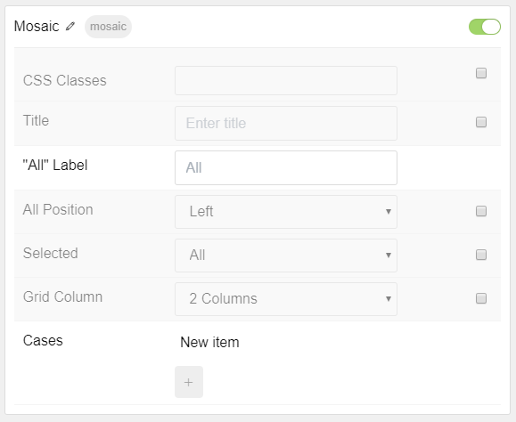
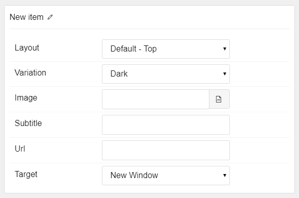

## Introduction

The **Mosaic** is a great way to showcase your site's content.

Here are the topics covered in this guide:

* [Configuration](#configuration)
    - [Main Options](#main-options)
    - [Item Options](#item-options)

## Configuration

### Main Options 

These options affect the main area of the particle, and not the individual items within.

 

| Option        | Setting                                                               |
| :-----        | :-----                                                                |
| Particle Name | The name of the particle for organizational use in the backend.       |
| CSS Classes   | CSS Class(es) you would like to have apply to the particle's content. |
| Title         | Title of the particle as it will appear on the front end.             |
| Grid Column   | Number of column(s) to display content in.                            |

### Item Options

These items make up the individual featured items in the particle.

| Option    | Description                                                |
| :-----    | :-----                                                     |
| Name      | Enter a name for your item. This appears on the front end. |
| Layout    | Select a layout type for the item.                         |
| Variation | Choose between light and dark color variations.            |
| Image     | Choose an image to display in the item.                    |
| Subtitle  | Enter a subtitle for the item.                             |
| URL       | Enter a URL you wish to have the item link to.             |
| Target    | Select a target for the URL.                               |
